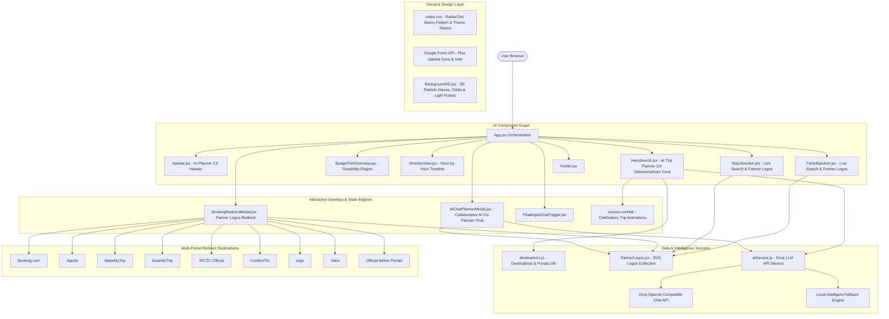
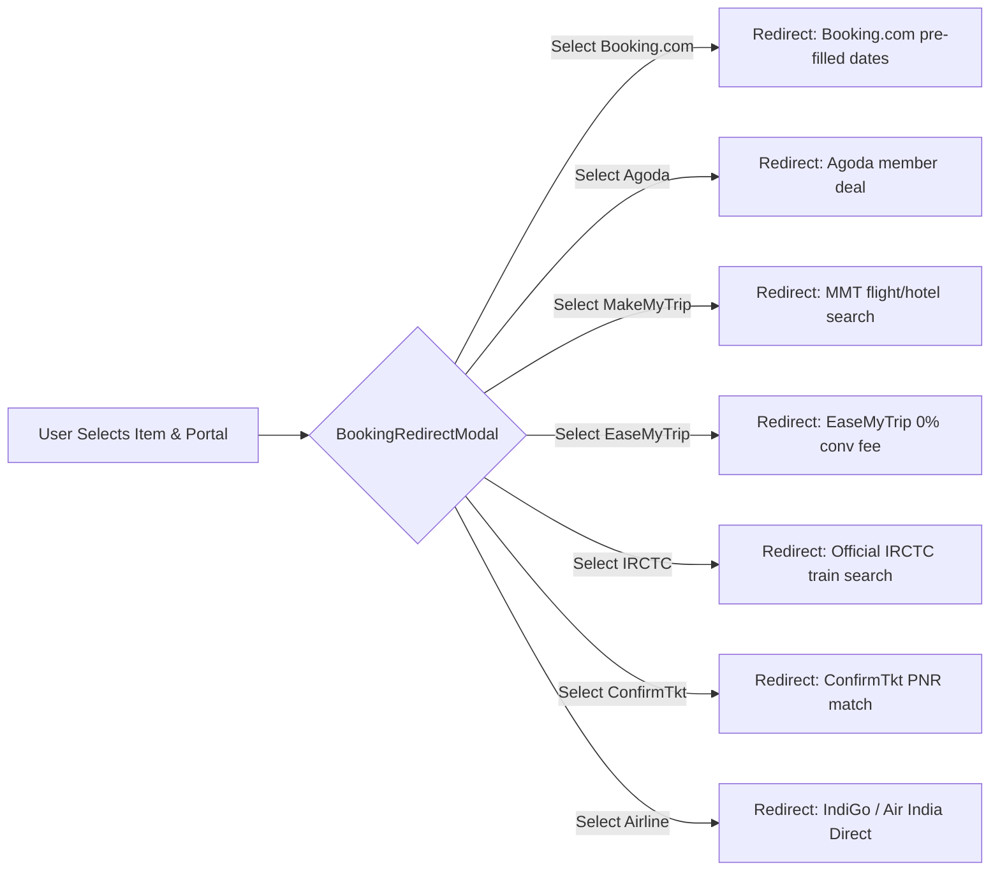
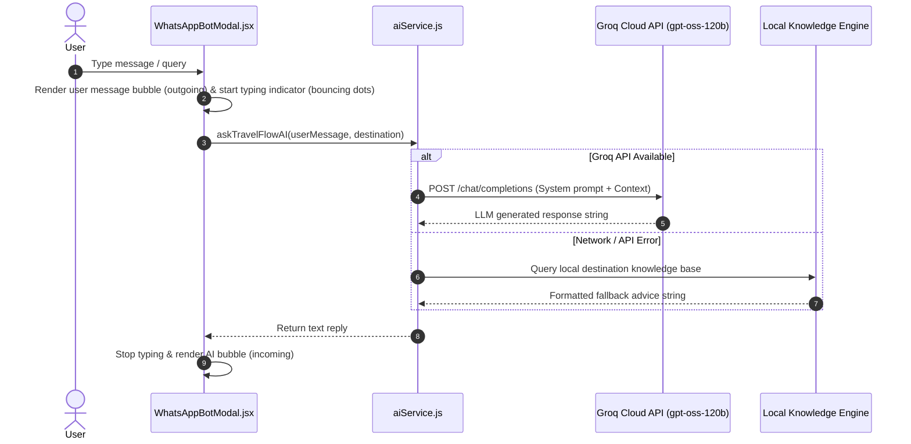

# 🗺️ Travelflow — Graphical Memory & System Architecture Graph

This document serves as a **Graphical Memory Specification** for Travelflow. It is structured using machine-parseable JSON schemas, visual Mermaid graph diagrams, state machine topologies, and component dependency trees to allow any AI agent or developer to instantly parse, understand, and navigate the application's design system, data model, routing logic, and LLM integrations.

---

## 1. System Topology Graph (Mermaid Architecture Map)



---

## 2. Machine-Parseable Application Schema Graph (JSON Memory)

```json
{
  "graph_version": "2.0.0",
  "project": {
    "name": "Travelflow",
    "type": "Vite + React 19 Single-Page Web Application",
    "aesthetic": "Modern Solid Aesthetic with Canvas/Canva Sans Typography & Radial Dot Matrix Background",
    "root_file": "src/App.jsx",
    "stylesheet": "src/styles/index.css"
  },
  "nodes": [
    {
      "id": "node_app",
      "name": "App.jsx",
      "role": "State Orchestrator",
      "state_managed": ["selectedDestId", "tripParams", "activeTier", "redirectModalData", "isAIChatOpen", "activeSection", "customActivities"],
      "dependencies": ["Navbar", "HeroSearch", "Background3D", "BudgetTierOverview", "ItineraryView", "TransitSection", "StaysSection", "Footer", "BookingRedirectModal", "AIChatPlannerModal", "FloatingAIChatTrigger", "destinations.js"]
    },
    {
      "id": "node_hero_search",
      "name": "HeroSearch.jsx",
      "role": "AI Trip Planner 3.0 Centerpiece",
      "features": ["Smart AI Configurator", "Natural Language Prompt Interface", "Dynamic Budget Range Slider", "Pace Control", "Trip Vibe Chips"],
      "inputs": ["sourceCity", "destinationId", "startDate", "endDate", "travelers", "budget", "tripPace", "selectedStyles"]
    },
    {
      "id": "node_budget_overview",
      "name": "BudgetTierOverview.jsx",
      "role": "Budget Feasibility Visualizer",
      "tiers": ["backpacker", "comfort", "luxury"],
      "allocation_breakdown": {
        "accommodations": "38%",
        "transit": "26%",
        "dining": "22%",
        "activities_and_buffers": "14%"
      }
    },
    {
      "id": "node_itinerary_view",
      "name": "ItineraryView.jsx",
      "role": "Day-by-Day & Hour-by-Hour Timeline",
      "activity_categories": ["attraction", "food", "transit", "buffer"],
      "features": ["Category filter pills", "Interactive activity checkboxes", "Print itinerary button", "Day estimated cost tally"]
    },
    {
      "id": "node_transit_section",
      "name": "TransitSection.jsx",
      "role": "Multi-Platform Rail & Air Comparator",
      "badge_types": ["cheapest", "fastest", "comfort"],
      "supported_portals": ["MakeMyTrip", "EaseMyTrip", "IRCTC Rail Connect", "ConfirmTkt", "ixigo", "Yatra", "IndiGo", "Air India"]
    },
    {
      "id": "node_stays_section",
      "name": "StaysSection.jsx",
      "role": "Multi-Platform Accommodation Comparator",
      "supported_portals": ["Booking.com", "Agoda", "MakeMyTrip", "Goibibo", "Hostelworld", "Hotel Direct"]
    },
    {
      "id": "node_booking_modal",
      "name": "BookingRedirectModal.jsx",
      "role": "Multi-Website Deep-Link Dispatcher",
      "function": "Allows user to choose from competing portal prices, pre-fills query routes, and redirects with 0% markup"
    },
    {
      "id": "node_whatsapp_modal",
      "name": "WhatsAppBotModal.jsx",
      "role": "Simulated AI Assistant & Payment Drawer",
      "ai_engine": "Groq LLM API (openai/gpt-oss-120b) with local fallback",
      "features": ["WhatsApp UI clone", "Live AI responses", "Quick option chips", "Simulated UPI/Card payment sheet", "Confetti celebratory trigger", "Demo PDF voucher generation"]
    }
  ],
  "design_tokens": {
    "font_family_sans": "Plus Jakarta Sans, Inter, sans-serif",
    "font_family_display": "Plus Jakarta Sans, sans-serif",
    "background": "#f7f9f8 with radial-gradient(rgba(0,0,0,0.09) 1.2px, transparent 1.2px) matrix dots",
    "colors": {
      "primary": "#0b221d",
      "primary_dark": "#051411",
      "accent": "#c4963d",
      "accent_light": "#faf3e5",
      "surface": "#ffffff",
      "border": "#e0e7e4",
      "success": "#15803d"
    }
  }
}
```

---

## 3. Data Routing & Multi-Website Deep-Link Logic Graph



---

## 4. WhatsApp AI LLM Conversational Sequence Graph



---

## 5. How Future AI Agents Should Use This Memory

1. **Context Parsing**: Any LLM reading this repo should look at `application_graph_schema.json` and the Mermaid graphs to understand that `App.jsx` holds central state for `selectedDestId`, `tripParams`, `activeTier`, and `redirectModalData`.
2. **Adding Destinations**: New destinations should be appended to `DESTINATIONS` array in [destinations.js](file:///c:/Users/Shivangi/Desktop/TravelFlow/src/data/destinations.js) following the schema with `platformOptions` array for multi-portal price comparisons.
3. **Styling Extensions**: All visual modifications MUST extend `src/styles/index.css` maintaining the `Plus Jakarta Sans / Inter` typography and the `radial-gradient` black dot matrix pattern.
